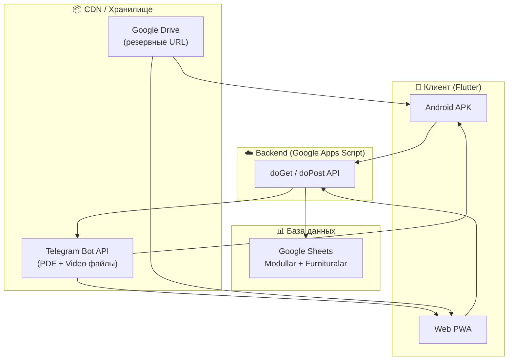
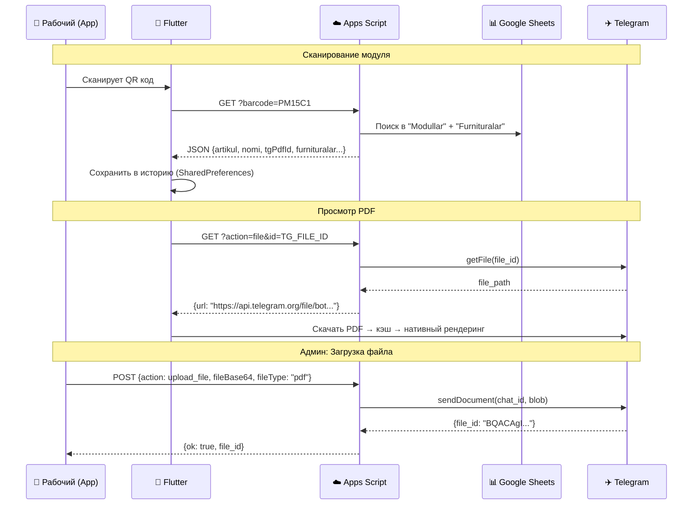

# 📦 Cabix Konveyer — Полный Walkthrough и Документация

## 🔷 Обзор проекта

**Cabix Konveyer** (внутреннее название репозитория `aristokrat_mebel` / `module_fl`) — это **Flutter-приложение (Android + Web PWA)** для мебельного производства **"Aristokrat Mebel"**.

**Назначение**: ERP-инструмент для работников конвейера, который позволяет:
1. **Сканировать QR/штрихкоды** на мебельных модулях
2. **Просматривать чертежи (PDF)** сборки модуля
3. **Смотреть видеоинструкции** по сборке
4. **Чеклист фурнитуры** — отмечать каждую деталь при сборке
5. **Админ-панель** (web) — управление базой модулей

---

## 🏗️ Архитектура системы



### Компоненты

| Компонент | Технология | Назначение |
|-----------|-----------|------------|
| **Мобильное приложение** | Flutter 3.x / Dart | Android APK для рабочих конвейера |
| **Web-приложение** | Flutter Web (PWA) | Браузерная версия для просмотра |
| **Админ-панель** | Vanilla HTML/CSS/JS | Управление модулями (CRUD) |
| **Backend API** | Google Apps Script | REST API (doGet/doPost) |
| **База данных** | Google Sheets | 2 листа: `Modullar` + `Furnituralar` |
| **Файловое хранилище** | Telegram Bot API | Хранение PDF и видео по `file_id` |
| **Резервное хранилище** | Google Drive | Fallback URL для PDF/видео |
| **CI/CD** | GitHub Actions | Автосборка APK + деплой Web на GitHub Pages |

---

## 📂 Структура проекта

```
module_fl-main/
├── .github/workflows/
│   ├── build_apk.yml          # CI: сборка Android APK (manual trigger)
│   └── deploy_web.yml         # CI: деплой Flutter Web → GitHub Pages
├── android/                   # Android-конфигурация
│   └── app/build.gradle.kts   # namespace: com.example.aristokrat_mebel, minSdk 21
├── web/
│   ├── admin.html             # 🔧 Админ-панель (полная SPA, 1277 строк)
│   ├── index.html             # Flutter Web entry point
│   └── icons/                 # Иконки приложения
├── lib/
│   ├── main.dart              # Entry point: AristokratApp → ShellPage
│   ├── core/
│   │   ├── constants/
│   │   │   └── app_colors.dart       # Цветовая палитра
│   │   └── utils/
│   │       └── offline_cache_manager.dart  # PDF кэширование
│   ├── data/
│   │   ├── models/
│   │   │   └── module_model.dart     # ModuleModel + FurnituraItem
│   │   └── repositories/
│   │       └── api_repository.dart   # API клиент + Telegram URL cache
│   └── features/
│       ├── shell/
│       │   └── presentation/
│       │       └── shell_page.dart    # Главный scaffold с bottom nav
│       ├── home/
│       │   ├── controllers/
│       │   │   └── history_controller.dart  # История сканирований
│       │   └── presentation/
│       │       └── home_page.dart     # Главная страница + гайд
│       ├── scanner/
│       │   └── presentation/
│       │       ├── scanner_page.dart         # QR/Barcode сканер
│       │       ├── gallery_scan_button.dart   # Кнопка сканирования из галереи
│       │       ├── gallery_scan_mobile.dart   # Mobile: ImagePicker → MobileScanner
│       │       ├── gallery_scan_web.dart      # Web: файл-сканер
│       │       └── gallery_scan_stub.dart     # Stub для компиляции
│       └── module_details/
│           ├── controllers/
│           │   └── checklist_controller.dart  # Чеклист фурнитуры
│           └── presentation/
│               ├── module_details_page.dart   # Фурнитура: аккордеон + чеклист
│               ├── media_view_page.dart       # PDF/Video просмотр (709 строк!)
│               ├── media_pdf_helper.dart      # Drive URL парсинг
│               ├── web_iframe.dart            # Web: HtmlElementView для iframe
│               ├── web_iframe_stub.dart       # Mobile: WebView fallback
│               └── custom_youtube_html.dart   # Кастомный YouTube плеер
├── gsheets_code.gs            # ⚡ Google Apps Script backend (v4.0)
├── pubspec.yaml               # Flutter зависимости
└── pubspec.lock               # Lock-файл
```

---

## 🔑 Ключевые зависимости

| Пакет | Версия | Назначение |
|-------|--------|------------|
| `flutter_riverpod` | ^2.6.1 | State management |
| `mobile_scanner` | ^5.0.0 | QR/Barcode сканирование камерой |
| `image_picker` | ^1.1.2 | Выбор изображения из галереи |
| `http` | ^1.2.1 | HTTP запросы к API |
| `shared_preferences` | ^2.2.2 | Локальное хранилище (история, чеклист) |
| `pdfx` | ^2.9.2 | Нативный рендеринг PDF |
| `webview_flutter` | ^4.7.0 | WebView для Drive/YouTube |
| `video_player` | ^2.8.7 | Видео плеер |
| `chewie` | ^1.13.0 | UI обёртка для видео |
| `connectivity_plus` | ^6.1.5 | Мониторинг сети |
| `flutter_cache_manager` | ^3.3.1 | PDF офлайн кэш |
| `audioplayers` | ^6.6.0 | Звук при сканировании |
| `screen_protector` | ^1.3.3 | Защита экрана |
| `pointer_interceptor` | ^0.10.1+1 | Перехват кликов поверх WebView |

---

## 📱 Экраны приложения

### 1. Shell (Навигация)
> [shell_page.dart](file:///Users/max/Downloads/module_fl-main/lib/features/shell/presentation/shell_page.dart)

- **Bottom Navigation Bar** с 4 вкладками:
  - 🏠 **Bosh sahifa** (История) — всегда доступна
  - 📐 **Chizma** (PDF чертёж) — после сканирования
  - ▶️ **Video** — после сканирования
  - 📦 **Furnitura** — после сканирования
- **FAB** (центральная кнопка) — открывает QR сканер
- **Full-screen mode** — скрывает AppBar и BottomNav для просмотра PDF/видео
- Использует `IndexedStack` для сохранения состояния всех страниц

### 2. Главная страница (История)
> [home_page.dart](file:///Users/max/Downloads/module_fl-main/lib/features/home/presentation/home_page.dart)

- **Инструкция** — карточка с 4 шагами использования
- **Список историй сканирования** — до 20 последних модулей
- Миниатюры из Google Drive (если есть `pdfUrl`)
- Иконки наличия PDF/видео/фурнитуры
- Нажатие → переход на вкладку «Фурнитура»
- **Полный гайд** — модальное окно с инструкциями

### 3. QR Сканер
> [scanner_page.dart](file:///Users/max/Downloads/module_fl-main/lib/features/scanner/presentation/scanner_page.dart)

- **Камера** — сканирование QR, Code128, Code39, EAN13
- **Галерея** — выбор фото с QR из галереи (`gallery_scan_button.dart`)
- **Фонарик** — переключение torch
- **Звуковой сигнал** (beep) при успешном сканировании
- После найденного кода:
  1. Камера останавливается
  2. API запрос к Google Apps Script
  3. Результат сохраняется в Riverpod state
  4. Модуль добавляется в историю
  5. Переход на вкладку «Фурнитура»

### 4. Просмотр PDF / Видео
> [media_view_page.dart](file:///Users/max/Downloads/module_fl-main/lib/features/module_details/presentation/media_view_page.dart)

**Универсальная страница** — тип определяется параметром `type: 'pdf' | 'video'`.

#### PDF:
- **Приоритет источника**: Telegram `file_id` → Google Drive URL
- **Mobile**: Нативный рендеринг через `pdfx` (скачивание + кэш), fallback на WebView (Drive Preview)
- **Web**: Google Docs Viewer iframe или Drive Preview
- **Оффлайн**: PDF загружается в кэш для работы без интернета
- **Управление**: поворот экрана (landscape), полный экран, счётчик страниц

#### Video:
- **Приоритет**: Telegram video → YouTube embed → Drive preview
- **Mobile**: WebView с HTML `<video>` тегом (для Telegram URL) или iframe (YouTube/Drive)
- **Web**: `<video>` для прямых URL, iframe для YouTube/Drive
- **Защита от скачивания**: `controlslist="nodownload"`
- **Кастомный YouTube плеер**: свайпы (перемотка/громкость), double-tap ±10s, speed/quality

### 5. Фурнитура (Чеклист)
> [module_details_page.dart](file:///Users/max/Downloads/module_fl-main/lib/features/module_details/presentation/module_details_page.dart)

- **Аккордеон** по категориям фурнитуры
- **Чеклист**: отметка каждой детали (✅ / ⬜)
- **Автосортировка**: отмеченные падают вниз
- **Счётчик**: показывает `unchecked/total` для каждой категории
- **Persistence**: состояние чеклиста сохраняется в `SharedPreferences`
- **Визуал**: зачёркивание, цветовые индикаторы (зелёный/красный + количество)

---

## 🔧 Админ-панель (Web)
> [admin.html](file:///Users/max/Downloads/module_fl-main/web/admin.html)

Отдельная одностраничная веб-панель `admin.html` (45KB) для управления базой модулей.

### Функции:
- **Аутентификация** — пароль → проверка через `ping` API
- **Dashboard** — статистика: общее кол-во модулей, PDF (TG), Video (TG), записи фурнитуры
- **Список модулей** — grid-карточки с тегами статуса:
  - `✈️ PDF` / `✈️ Video` — загружено в Telegram
  - `☁️ PDF` / `☁️ Video` — из Google Drive
  - `PDF yo'q` / `Video yo'q` — отсутствует
- **Фильтры**: Все / TG / Без PDF / Без Video
- **Сортировка**: по артикулу ↑↓ / по имени / по фурнитуре
- **Поиск** — по артикулу и названию
- **CRUD модуля** (модальное окно):
  - Артикул + название
  - **PDF**: загрузка файла → Telegram (base64), ввод file_id, Google Drive URL
  - **Video**: загрузка файла → Telegram, ввод file_id, YouTube/Drive URL
  - **Фурнитура**: динамический редактор категорий + элементов
  - Удаление модуля
- **Горячие клавиши**: `N` — новый модуль, `R` — обновить, `Ctrl+S` — сохранить, `Esc` — закрыть

### Дизайн:
- Dark mode (Industrial Dark + Amber palette)
- Шрифты: DM Sans + JetBrains Mono
- Анимации: fadeUp, slideIn, shimmer, skeleton loading
- Toast-уведомления, progress-бары загрузки

---

## ⚡ Backend (Google Apps Script)
> [gsheets_code.gs](file:///Users/max/Downloads/module_fl-main/gsheets_code.gs)

### API Endpoints (v4.0):

#### `doGet` — GET запросы
| Параметр | Описание |
|----------|----------|
| `?barcode=XXX` | Поиск модуля по артикулу (без пароля) |
| `?action=file&id=FILE_ID` | Получить Telegram file URL (без пароля) |
| `?action=modules&password=XXX` | Все модули (admin) |
| `?action=ping&password=XXX` | Проверка соединения |

#### `doPost` — POST запросы (JSON body)
| Action | Описание |
|--------|----------|
| `save_module` | Создать/обновить модуль + фурнитуру |
| `delete_module` | Удалить модуль + его фурнитуру |
| `upload_file` | Загрузить файл в Telegram (base64 → Bot API) |

### Google Sheets структура:

**Лист `Modullar`**:
| A | B | C | D | E | F |
|---|---|---|---|---|---|
| artikul | nomi | tgPdfId | tgVideoId | pdfUrl | videoUrl |

**Лист `Furnituralar`**:
| A | B | C | D | E |
|---|---|---|---|---|
| artikul | kategoriya | nomi | ulchov | soni |

### Telegram интеграция:
- **Загрузка PDF** → `sendDocument` → получение `file_id`
- **Загрузка Video** → `sendVideo` (fallback: `sendDocument`) → получение `file_id`
- **Получение URL** → `getFile` → временный download URL (действует ~1 час)

---

## 🔄 Поток данных (Data Flow)



---

## 🚀 CI/CD

### 1. Сборка APK (`build_apk.yml`)
- **Триггер**: Manual (`workflow_dispatch`)
- **Типы сборки**: split (по ABI), universal, arm64, armv7
- **Автоинкремент**: `versionCode += 1` и commit обратно в репо
- **Артефакт**: APK файл загружается в GitHub Actions Artifacts

### 2. Деплой Web (`deploy_web.yml`)
- **Триггер**: Push в `main`
- **Сборка**: `flutter build web --release --base-href /module_fl/`
- **Деплой**: GitHub Pages (ветка `gh-pages`)

---

## 🔒 Безопасность

| Механизм | Описание |
|----------|----------|
| Парольная защита | Admin API требует `password` (настраивается в `CONFIG`) |
| Barcode API без пароля | Рабочие могут сканировать без авторизации |
| Telegram CDN | Файлы хранятся в Telegram канале, URL временные (~1 час) |
| Download protection | Video с `controlslist="nodownload"`, YouTube shields |
| URL кэширование | Telegram URL кэшируются на 50 минут |
| Screen protector | Пакет `screen_protector` для защиты содержимого |

---

## 💾 Локальное хранилище

| Ключ (SharedPreferences) | Данные |
|--------------------------|--------|
| `scan_history` | JSON массив последних 20 модулей |
| `checked_items` | Set строк формата `{artikul}_{category}_{index}` |

PDF файлы кэшируются в `tmp/pdf_{key}.pdf` через `flutter_cache_manager`.

---

## 🌐 Поддержка платформ

| Платформа | Статус | Особенности |
|-----------|--------|-------------|
| **Android** | ✅ Основная | Камера, нативный PDF, WebView для видео |
| **Web (PWA)** | ✅ Поддерживается | iframe для PDF/видео, HTML5 `<video>` для TG |
| **iOS** | ⚠️ Не настроен | Нет iOS конфигурации в проекте |

---

## 📝 Конфигурация

### API URL (нужно изменить при деплое):
- [api_repository.dart](file:///Users/max/Downloads/module_fl-main/lib/data/repositories/api_repository.dart#L8-L9) → `apiUrl`
- [admin.html](file:///Users/max/Downloads/module_fl-main/web/admin.html#L811) → `API`

### Apps Script Config:
- [gsheets_code.gs](file:///Users/max/Downloads/module_fl-main/gsheets_code.gs#L6-L12) → `CONFIG.BOT_TOKEN`, `CONFIG.CHAT_ID`, `CONFIG.PASSWORD`

---

## 🛠️ Как запустить

### Мобильное приложение:
```bash
cd /Users/max/Downloads/module_fl-main
flutter pub get
flutter run                    # Debug на подключённом устройстве
flutter build apk --release    # Release APK
```

### Web-версия:
```bash
flutter build web --release
# Или для dev:
flutter run -d chrome
```

### Админ-панель:
Просто откройте `web/admin.html` в браузере (или задеплойте на сервер).

### Backend:
1. Создайте Google Sheet с листами `Modullar` и `Furnituralar`
2. Откройте Apps Script → вставьте `gsheets_code.gs`
3. Настройте `CONFIG` (Bot Token, Chat ID, Password)
4. Deploy → Web App → Anyone can access
5. Скопируйте URL в `api_repository.dart` и `admin.html`
